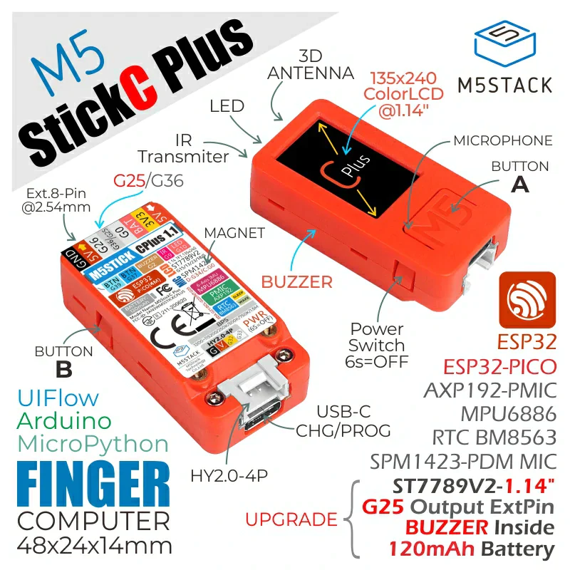
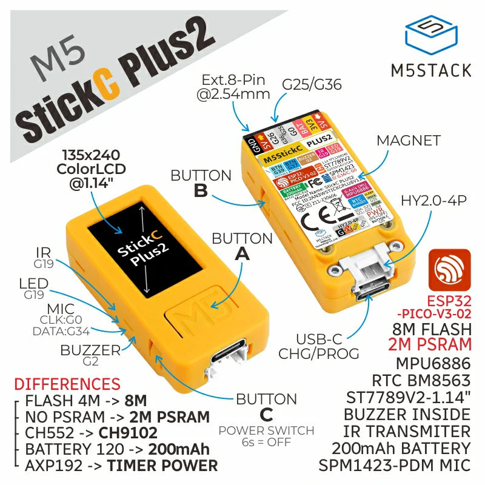

# M5 Stick Plus BLE IMU Sketch

## M5 Stick Plus/Plus2 Setup

The M5 Stick Plus (and Plus2) uses the ESP32-PICO. The drivers can be found in the `drivers` directory.



### Board and Libraries Setup

#### VSCode and PlatformIO (Preferred)

VSCode has an amazing extension called [`PlatformIO`](https://platformio.org/install/ide?install=vscode) to work with ESP32 or Arduino boards.

Once installed, it automatically sets up the board for you.
Importing libraries is fairly easy:

1. Open PlatformIO home from VSCode sidebar
2. Click on Libraries search for `M5Core` to install the neede stack, or install `M5GFX` and `M5Unified` individually if needed

You can read the serial monitor by using `minicom`

```zsh
brew install minicom
minicom -D /dev/tty.usbserial-57740040031 -b 115200
```

You can also setup a terminal profile on VSCode, e.g.:

```json
"terminal.integrated.profiles.osx": {
  "SerialMonitor": {
      "overrideName": "M5Stick Monitor",
      "path": "/bin/zsh",
      "args": [
          "-l",
          "-c",
          "minicom -D /dev/tty.usbserial-57740040031 -b 115200"
      ]
  }
}
```

#### Arduino IDE

1. [Download Arduino IDE](https://www.arduino.cc/en/software) and install it
2. Setup M5 Libraries

- Open the Library manager (From the sidebar on Windows or `Tools > Manage Libraries` on MacOS)
- Look for `M5Core` and install `M5Core2` (at the time of writing the latest version is `0.1.9`)
- Click on "Install All"

3. Add M5 Stick boards to Arduino IDE:

- Go to `Settings/Preferences` in the `Settings` tab, at the bottom ,there should be a `Additional boards manager URLs`
- Paste this URL `https://static-cdn.m5stack.com/resource/arduino/package_m5stack_index.json` in it and confirm

### User Demo Program

The example program running by default on the M5 Stick Plus 2 can be found here: https://github.com/m5stack/M5StickCPlus2-UserDemo
I have downloaded the latest version as of 25/04/2024 in `drivers/M5StickCPlus2-UserDemo-main.zip`

### M5 Stick Plus2 Lib Program

M5Stick C Plus2 Library program can be found here: https://github.com/m5stack/M5StickCPlus2
I have downloaded the latest version as of 25/04/2024 in `drivers/M5StickCPlus2-master.zip`

This program nees the `PlatformIO` VSCode extension to run: https://platformio.org/install/ide?install=vscode

It might show some issues in finding the `arduinoFFT.h` library even when it has been installed. I've downloaded the source file from: https://www.arduino.cc/reference/en/libraries/arduinofft/

Then copied `arduinoFFT.h` and `arduinoFFT.cpp` to the `src/test` folder. After that I had to change a few lines: the type `ArduinoFFT` is a templated class type which needs an extra type, I chose `double` so `ArduinoFFT<double>` will be the type and the constructor an init code is as follows:

```Cpp
#include "arduinoFFT.h"
...
ArduinoFFT<double> _FFT;
...
_FFT = ArduinoFFT<double>(_vReal, _vImag, _samples, _samplingFrequency);
_FFT.windowing(FFT_WIN_TYP_HAMMING, FFT_FORWARD); // Notice that all function calls were capitalized in the original library, idk why...
_FFT.compute(FFT_FORWARD);
_FFT.complexToMagnitude();
```

If you get errors regarding `FS.h` not being found, make sure you installed the appropriate ESP32 drivers under `drivers` and MAKE SURE TO RESTART YOUR LAPTOP!

Finally, don't forget to install the [`EspressIF32` toolchain](https://docs.espressif.com/projects/esp-idf/en/stable/esp32/get-started/linux-macos-setup.html), on MacOS (With Apple Silicon M1/2/3 chips) the steps are these:

Install the necessary packages:

```zsh
/usr/sbin/softwareupdate --install-rosetta --agree-to-license
brew install cmake ninja dfu-util ccache
```

Download and install the espd-if library:

```zsh
mkdir -p ~/esp
cd ~/esp
git clone -b v5.2.1 --recursive https://github.com/espressif/esp-idf.git
cd ~/esp/esp-idf
./install.sh esp32
. ./export.sh
```

Don't forget the last line `. ./export.sh` or your `PATH` variable won't be updated.

If you keep getting errors with `FS.h` add `lib_ldf_mode=deep` to your `platformio.ini` ([GitHub issue solution](https://github.com/me-no-dev/ESPAsyncWebServer/issues/520))

## Craftsman BLE

The starting repo can be found here: https://github.com/ugmurthy/CraftsmanBLE
Here is an excerpt of the readme:

CraftsMan BLE is designed to send accelerometer&Gyroscope data over BLE and serial port toany BLE Client and/or computer with a serial port.

Systems requirements:

1. M5 Stick-C Plus (the device that will send the data) as BLE Server
2. BLE Client a Mobile phone using **Bluefruit LE Connect** on iOS or Android
3. and a Laptop with Arduino IDE

### Installation

1. Download the CraftsmanBLE.ino file to your Arduino sketches directory
2. Compile it (Make necessary changes in case you are using a M5-Stick instead of a M5 Stick C plus. Note the only changes needed with be the Button numbers for Button A,B, IMU initialisation and IMU read commands, and the LCD print commands.

### Usage

1. Reset the M5-StickC plus
2. Connect Mobile to "Kosha Craftsman" servie using the BLE software
3. Hit Connect
4. Click UART under modules section
5. On the M5-StickC Plus - Click Button A to start reading IMU readings
6. After a few seconds click Button A to stop the accelerometer readings.
7. M5 Screen will show the number of readings taken(see last line)
8. Click button B - to dump the readings in CSV format to BLE Client device
9. Click "Settings" icon, Export, Copy as txt.

10. Long Press A to restart device.

### Version 2.0 Usage instructions

Version 2.0 allows control of M5 from the BLE Client device as follows

- All commands are single letter command (case insensitive)
- An optional integer (max 3 digits) follows the command

| S.No | Commands | Argument |           Remarks           |
| :--: | :------: | :------: | :-------------------------: |
|  1   |    S     |   None   |      Start reading IMU      |
|  2   |    S     |   None   |      Stop reading IMU       |
|  3   |    D     |   None   | Dump readinds to BLE Server |
|  4   |    R     |   None   |         Restart M5          |
|  5   |    P     |   nnn    | Set period to nnn millisecs |
|  6   |    O     |   nnn    | Set offset to nnn millisecs |

introduced a way to control M5 from the mobile phone

### Libraries used

1. M5 Stick C plus
2. ESP32 Arduino BLE
3. Easybutton
